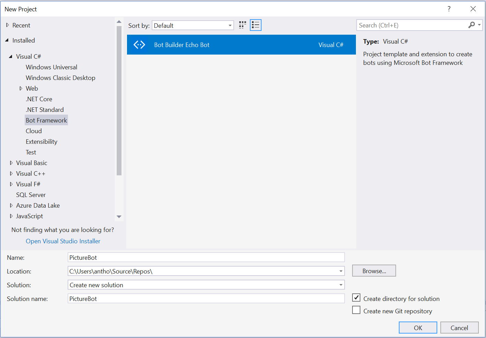
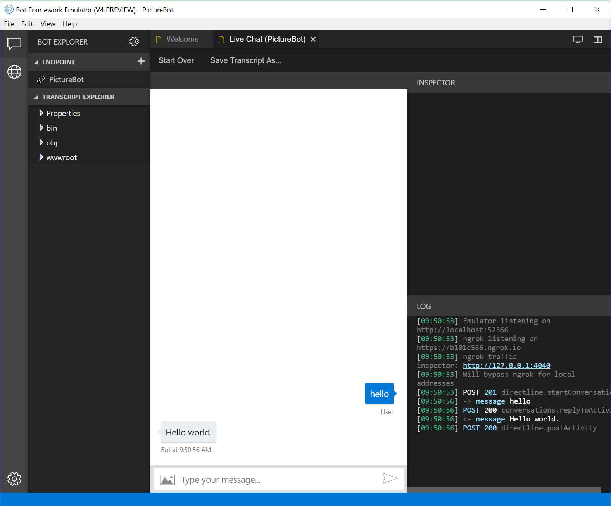
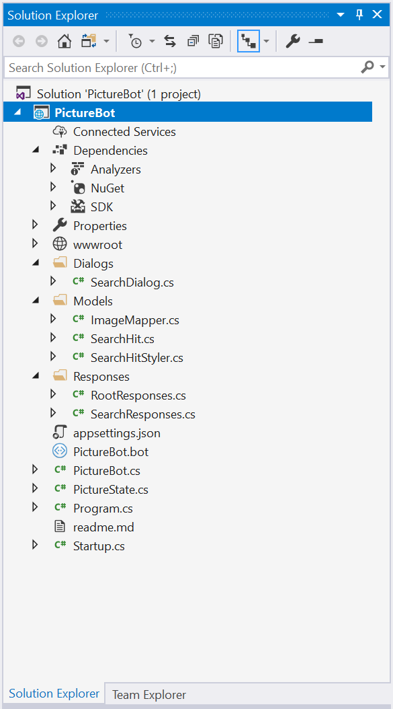

## 1_Dialogs_and_Regex:

Estimated Time: 45-60 minutes

## Building a Bot

We assume that you've had some exposure to the Bot Framework. If you have, great. If not, don't worry too much, you'll learn a lot in this section. We recommend completing [this tutorial](https://docs.microsoft.com/en-us/azure/bot-service/dotnet/bot-builder-dotnet-sdk-quickstart?view=azure-bot-service-4.0) and checking out the [documentation](https://docs.microsoft.com/en-us/bot-framework/).

### Lab 1.1: Setting up for bot development

We will be developing a bot using the latest .NET SDK (v4). To get started, we'll need to download the Bot Framework Emulator, and we'll need to clone and build the SDK. We'll emulate everything locally in this lab, and won't need any keys or services at this point.

#### Download the Bot Framework Emulator

You can download the v4 Preview Bot Framework Emulator for testing your bot locally. The instructions for the rest of the labs will assume you've downloaded the v4 Emulator. Download the emulator by going to [this page](https://github.com/Microsoft/BotFramework-Emulator/releases) and download the most recent version of the emulator (select the ".exe" file, if you are using windows).

The emulator installs to `c:\Users\`_your-username_`\AppData\Local\botframework\app-`_version_`\botframework-emulator.exe` or to your Downloads folder, depending on browser.

#### Download the Bot Builder Template

Download the [Bot Builder SDK v4 Template for C# here](https://marketplace.visualstudio.com/items?itemName=BotBuilder.botbuilderv4) and click "Save as" to save it to your Visual Studio ItemTemplates folder for Visual C#. This is typically located in `C:\Users\`_your-username_`\Documents\Visual Studio 2017\Templates\ItemTemplates\Visual C#`. Navigate to the folder location and double-click on the install and click "Install" to add the template to your Visual Studio templates. Depending on your browser, when you download the template, you can double-click on it and install it directly to Visual Studio Community 2017; that is fine.

### Lab 1.2: Creating a simple bot and running it

Open Visual Studio, and create a new project (select **File > New > Project**) and title it "PictureBot". Make sure to select the "Echo Bot" template.



Select **OK**. You'll now see a template for a simple Echo Bot that can echo users' messages and keep track of turns (how many messages have been sent between user and bot).

> **TIP**: If you only have one monitor and you would like to easily switch between instructions and Visual Studio, you can add the instruction files to your Visual Studio solution by right-clicking on the project in Solution Explorer and selecting **Add > Existing Item**. Navigate to "lab02.2-bulding_bots," and add all the files of type "MD File."

Right-click on the solution in Solution Explorer and select "Manage NuGet Packages for Solution." Install all of the packages listed below (you may already have some of these and that is fine, you shouldn't need to reinstall or update them). Make sure you check the box "Include prerelease" and are on the "Browse" tab. After you've installed them, under **Dependencies > NuGet** in your Solution Explorer, you should see the following packages:

- Microsoft.Bot.Builder.Dialogs 4.2.0

Next, review the Startup.cs file. There are many comments within to help you understand what is happening. Spend a few minutes reading through.

Update the list of `using` statements to the following:

```csharp
using System;
using Microsoft.AspNetCore.Builder;
using Microsoft.AspNetCore.Hosting;
using Microsoft.Bot.Builder.BotFramework;
using Microsoft.Bot.Builder.Core.Extensions;
using Microsoft.Bot.Builder.Integration.AspNet.Core;
using Microsoft.Extensions.Configuration;
using Microsoft.Extensions.DependencyInjection;
using System.Text.RegularExpressions;
using Microsoft.Bot.Builder.Ai.LUIS;
```

Replace the ConfigureServices method with the following:

```csharp
// This method gets called by the runtime. Use this method to add services to the container.
        public void ConfigureServices(IServiceCollection services)
        {
            services.AddBot<PictureBot.PictureBot>(options =>
            {
                options.CredentialProvider = new ConfigurationCredentialProvider(Configuration);
                var middleware = options.Middleware;

                IStorage dataStore = new MemoryStorage();

                var conversationState = new ConversationState(dataStore);
                options.State.Add(conversationState);

                var userState = new UserState(dataStore);
                options.State.Add(userState);

            });

            services.AddSingleton<PictureBotStateAccessors>(sp =>
            {
                var options = sp.GetRequiredService<IOptions<BotFrameworkOptions>>().Value;
                if (options == null)
                {
                    throw new InvalidOperationException("BotFrameworkOptions must be configured prior to setting up the state accessors");
                }

                var conversationState = options.State.OfType<ConversationState>().FirstOrDefault();
                if (conversationState == null)
                {
                    throw new InvalidOperationException("ConversationState must be defined and added before adding conversation-scoped state accessors.");
                }

                // Create the custom state accessor.
                // State accessors enable other components to read and write individual properties of state.
                var accessors = new PictureBotStateAccessors(conversationState)
                {
                    GreetingState = conversationState.CreateProperty<GreetingState>(PictureBotStateAccessors.GreetingStateName),
                };

                return accessors;
            });
        }
```

You should see an error (red squiggly) beneath "PictureBot", "UserData", and "ConversationInfo", because we haven't created those yet. This is where we'll store the context of the conversation with our users. Remember, we're only using local memory for testing purposes. For production, you'll have to implement a way to [manage state data](https://docs.microsoft.com/en-us/azure/bot-service/bot-builder-storage-concept?view=azure-bot-service-4.0).

Delete the EchoBot.cs and EchoState.cs files. If you want to explore the EchoBot further, you can follow [this tutorial](https://docs.microsoft.com/en-us/azure/bot-service/dotnet/bot-builder-dotnet-sdk-quickstart?view=azure-bot-service-4.0) **later**.

Create a GreetingState.cs class file. Update the file to this:

```csharp
namespace ImageBot
{
    public class GreetingState
    {
        public string Greeted { get; set; } = "not greeted";
    }
}
```

Save the file. This is where we'll store information about the active conversation. You can see we're also keeping track of whether we've greeted the user, so we don't do it more than once. This should address our error in Startup.cs. Confirm this.

Create a PictureBot.cs class file. Update the file to this:

```csharp
using System.Threading.Tasks;
using Microsoft.Bot.Builder;
using Microsoft.Bot.Schema;
using Microsoft.Bot;

namespace PictureBot
{
    public class PictureBot : IBot
    {
       public async Task OnTurnAsync(ITurnContext context, CancellationToken cancellationToken = default(CancellationToken))
        {
            if (context.Activity.Type is ActivityTypes.Message)
            {
                await context.SendActivityAsync($"Hello world.");
            }
        }
    }
}
```

Now start your bot (with or without debugging) by pressing the "IIS Express" button that looks like a play button (or hit F5). NuGet should take care of downloading the appropriate dependencies.

- Your default.htm page will be displayed in a browser.
- Note the localhost port number for the page. You will need this information to interact with your bot.

#### Using the Bot Framework Emulator

To interact with your bot:

- Launch the Bot Framework Emulator (note we are using the v4 PREVIEW Emulator). (If you just installed it, it may not be indexed to show up in a search on your local machine, so remember that it installs to `C:\Users\`your-username`\AppData\Local\botframework\app-`_version_`\botframework-emulator.exe`.)
- Select "Open bot" on the Welcome page and navigate to the "PictureBot.bot" file in the root of your project (probably something similar to `C:\Users\`your-username`\Source\Repos\PictureBot\PictureBot\PictureBot`).
- Now, you should be able to click the message tab (on the left menu) and the PictureBot listed under "ENDPOINT."
- You should now be able to converse with the bot.
- Type "hello", and the bot will respond with "Hello World" to every message.



You can read more about using the Emulator [here](https://docs.microsoft.com/en-us/azure/bot-service/bot-service-debug-emulator?view=azure-bot-service-4.0).

> Fun Aside: why this port number? It is set in your project properties. In your Solution Explorer, double-click **Properties>Debug** and examine its contents. Does the App URL match what you connected to in the emulator?

Browse around and examine the sample bot code. In particular, note:

- **Startup.cs** is where we will add services/middleware and configure the HTTP request pipeline.
- In **PictureBot.cs**, `OnTurnAsync` is the entry point which waits for a message from the user, and `context.Activity.Type is ActivityTypes.Message` is where we can react to a message once received and wait for further messages. We can use `context.SendActivityAsync` to send a message from the bot back to the user.

#### Using state

You manage state with accessors, e.g.

```csharp
var state = await _accessors.GreetingState.GetAsync(context, () => new GreetingState(), cancellationToken);
//...

await _accessors.ConversationState.SaveChangesAsync(context, false, cancellationToken);
```

Modify `OnTurnAsync` to send back "Hi again" for every message besides the first.

### Lab 1.3: Organizing Code for Bots

There are many different methods and preferences for developing bots. The SDK allows you to organize your code in whatever way you want. In these labs, we'll organize our conversations into different dialogs, and we'll explore a [MVVM style](https://msdn.microsoft.com/en-us/library/hh848246.aspx) of organizing code around conversations.

This PictureBot will be organized in the following way:

- **Dialogs** - the business logic for editing the models
- **Responses** - classes which define the outputs to the users
- **Models** - the objects to be modified

Next, create a folder for each piece in your PictureBot project (create three folders: "**Dialogs**", "**Responses**", "**Models**").

#### Dialogs

If you developed bots with the Bot Framework SDK (v3), then you're probably familiar with Dialogs and how they work. If you aren't, read [this page on Dialogs](https://docs.microsoft.com/en-us/azure/bot-service/bot-builder-dialog-manage-conversation-flow?view=azure-bot-service-4.0&tabs=csharp) before continuing.

When a bot has the ability to perform multiple tasks, it is nice to be able to have multiple dialogs, or a set of dialogs, to help users navigate through different conversation flows. For our PictureBot, we want our users to be able to go through our menu flow, often referred to as a root dialog, and then branch off to different dialogs depending what they are trying to do - search pictures, share pictures, order pictures, or get help. We can do this easily by using a dialog container. Read about [creating modular bot logic with dialog containers](https://docs.microsoft.com/en-us/azure/bot-service/bot-builder-compositcontrol?view=azure-bot-service-4.0&tabs=csharp) before continuing.

For the purposes of this lab, we are going to keep things simple, but after, you should be able to create a dialog container with many dialogs. For our PictureBot, we'll have two main dialogs:

- **RootDialog** - The default dialog the bot starts out with. This dialog will start other dialog(s) as the user requests them. This dialog, as it is the main dialog for the dialog set, will be responsible for creating the container and redirecting users to other dialogs as needed.
- **SearchDialog** - A dialog which manages processing search requests and returning those results to the user.

Create a class, called "RootDialog.cs" within the "Dialogs" folder. Replace the contents with the following shell:

```csharp
using System.Threading;
using System.Threading.Tasks;
using Microsoft.Bot.Builder;
using Microsoft.Bot.Builder.Dialogs;

namespace ImageBot.Dialogs
{

    public class RootDialog : DialogSet
    {
        public const string Id = "rootDialog";
        private const string TextPrompt = "textPrompt";

        public RootDialog(IStatePropertyAccessor<DialogState> dialogStateAccessor)
            : base(dialogStateAccessor)
        {
            Add(new WaterfallDialog(
                Id,
                new WaterfallStep[]
                {
                    RootDialogSteps.PresentMenuAsync,
                    RootDialogSteps.RunDialogsAsync,
                }));
            Add(new TextPrompt(TextPrompt));
        }

        private static class RootDialogSteps
        {
            public static async Task<DialogTurnResult> PresentMenuAsync(
                WaterfallStepContext stepContext,
                CancellationToken cancellationToken)
            {
                await stepContext.PromptAsync(TextPrompt, new PromptOptions { Prompt = MessageFactory.Text("How can I help?") }, cancellationToken);
                return Dialog.EndOfTurn;
            }

            public static async Task<DialogTurnResult> RunDialogsAsync(
                WaterfallStepContext stepContext,
                CancellationToken cancellationToken)
            {
                switch (stepContext.Result as string)
                {
                    default:
                        return Dialog.EndOfTurn;
                }
            }
        }
    }
}
```

Now we need to modify the configuration and main bot class to use our root dialog.

PictureBot has to store a `DialogSet` field which we initialize in constructor with

```csharp
_dialogs = new RootDialog(_accessors.DialogState);
```

For that to work we need to extend the accessors with:

```csharp
public IStatePropertyAccessor<DialogState> DialogState { get; set; }
public static string DialogStateAccessorName { get; } = $"{nameof(PictureBotStateAccessors)}.DialogState";
```

and initialize them in the startup's PictureBotStateAccessors setup with

```csharp
DialogState = conversationState.CreateProperty<DialogState>(PictureBotStateAccessors.DialogStateAccessorName),
```

Usually we start our turn by checking if we are in a dialog:

```csharp
if (context.Activity.Type is ActivityTypes.Message)
{
    DialogContext dc = await _dialogs.CreateContextAsync(context, cancellationToken);

    await dc.ContinueDialogAsync();
    // ...
}
```

if we are, then `context.Responded` will be true after we go through `ContinueDialogAsync`

Run the root dialog if we are not in a dialog with `await dc.BeginDialogAsync(RootDialog.Id);`

##### Adding second dialog

Create a SearchDialog class in Dialogs

```csharp
using System.Threading;
using System.Threading.Tasks;
using Microsoft.Bot.Builder.Dialogs;

namespace ImageBot.Dialogs
{
    public class SearchDialog : ComponentDialog
    {
        public const string DialogId = "searchPicture";

        public SearchDialog()
            : base(DialogId)
        {
            InitialDialogId = Id;

            AddDialog(new WaterfallDialog(
                Id,
                new WaterfallStep[]
                {
                    SearchDialogSteps.PresentMenuAsync,
                }));
        }

        private static class SearchDialogSteps
        {
            public static async Task<DialogTurnResult> PresentMenuAsync(
                WaterfallStepContext stepContext,
                CancellationToken cancellationToken)
            {
                await stepContext.Context.SendActivityAsync(
                    "Ready to search.",
                    cancellationToken: cancellationToken);
                return await stepContext.EndDialogAsync();
            }

        }
    }
}
```

Add it to the root dialog with `Add(new SearchDialog());`

When the user responds with "search" in RootDialog start the SearchDialog `stepContext.BeginDialogAsync(SearchDialog.DialogId)`

#### Responses

Create two classes, called "RootResponses.cs" and "SearchResponses.cs" within the "Responses" folder. As you may have figured out, the Responses files will simply contain the different outputs we may want to send to users, no logic.

Within "RootResponses.cs" add the following:

```csharp
using System.Threading.Tasks;
using Microsoft.Bot.Builder;

namespace PictureBot.Responses
{
    public class RootResponses
    {
        public static async Task ReplyWithGreeting(ITurnContext context)
        {
            // Add a greeting
        }
        public static async Task ReplyWithHelp(ITurnContext context)
        {
            await context.SendActivityAsync($"I can search for pictures, share pictures and order prints of pictures.");
        }
        public static async Task ReplyWithResumeTopic(ITurnContext context)
        {
            await context.SendActivityAsync($"What can I do for you?");
        }
        public static async Task ReplyWithConfused(ITurnContext context)
        {
            // Add a response for the user if Regex or LUIS doesn't know
            // What the user is trying to communicate
        }
        public static async Task ReplyWithLuisScore(ITurnContext context, string key, double score)
        {
            await context.SendActivityAsync($"Intent: {key} ({score}).");
        }
        public static async Task ReplyWithShareConfirmation(ITurnContext context)
        {
            await context.SendActivityAsync($"Posting your picture(s) on twitter...");
        }
        public static async Task ReplyWithOrderConfirmation(ITurnContext context)
        {
            await context.SendActivityAsync($"Ordering standard prints of your picture(s)...");
        }
    }
}
```

Note that there are two responses with no values (ReplyWithGreeting and ReplyWithConfused). Fill these in as you see fit.

Within "SearchResponses.cs" add the following:

```csharp
using Microsoft.Bot.Builder;
using System;
using System.Collections.Generic;
using System.Linq;
using System.Threading.Tasks;

namespace PictureBot.Responses
{
    public class SearchResponses
    {
        // add a task called "ReplyWithSearchRequest"
        // it should take in the context and ask the
        // user what they want to search for


        public static async Task ReplyWithSearchConfirmation(ITurnContext context, string utterance)
        {
            await context.SendActivity($"Ok, searching for pictures of {utterance}");
        }
        public static async Task ReplyWithNoResults(ITurnContext context, string utterance)
        {
            await context.SendActivity("There were no results found for \"" + utterance + "\".");
        }
    }
}
```

Note here a whole task is missing. Fill in as you see fit, but make sure the new task has the name "ReplyWithSearchRequest", or you may have issues later.

#### Models

Due to time limitations, we will not be walking through creating all the models. They are straightforward, and we recommend taking some time to review the code within after you've added them. Right-click on the "Models" folder and select **Add>Existing Item**. Navigate to "lab02.2-building_bots/resources/code/Models" (making sure you're in the SDK v4 directory!), select all three files, and select "Add."

At this point, your Solution Explorer should look similar to the following image:



Are you missing anything? Now's a good time to check.


### Continue to [2_Azure_Search](./2_Azure_Search.md)

Back to [README](./0_README.md)
